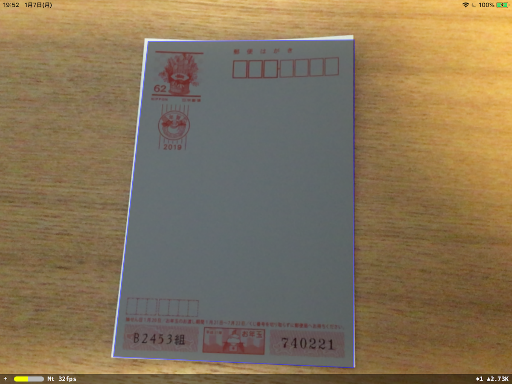
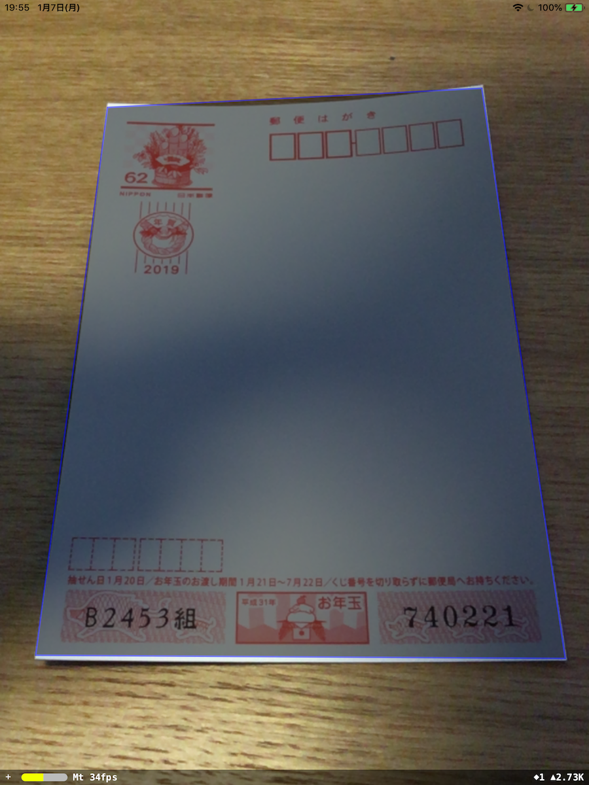

# ARKit + Vision for Real Time Rectangle Detection

This project demonstrates how to use Apple's Vision library to identify rectangles with ARKit.

## Screen Shot
### Landscape
  
### Portrait
  

## Background
This sample is based on ARKit and Vision.
If you're not already familiar with the [ARKit](https://developer.apple.com/documentation/arkit/understanding_augmented_reality) and [Vision](https://developer.apple.com/documentation/vision) libraries.

## How it Works
- The `@IBAction func doubleTapped(_ sender: Any)` method inside of `ViewController.swift` triggers to detect rectangle in the current frame.

- The `func findRectangle(frame currentFrame: ARFrame)` method gets an image in ARFrame and then kicks VNDetectRectangle. Be careful orientation of the image because video frame orientation is always landscape unless physical device orientation is portrait.

- The `func draw(rectangles: [VNRectangleObservation], onImageLayer drawlayer: CALayer)` method adds layer to draw a rectangle path.

- The `func shapeLayerRect(color: UIColor, observation: VNRectangleObservation) -> CAShapeLayer` method draws detected rectangle path. Detected rectangle 4 points are not suitable for showing on ARSCNView because world is not same. We have to change it by affine transform but it is complicated. It's a good way to get affine transform by [displayTransform()](https://developer.apple.com/documentation/arkit/arframe/2923543-displaytransform). 

## To Run
1. Prerquisites: You must have a device running iOS 12 with an A9 or later processor and XCode 10.1. Both of these are currently in beta but are available via the [Apple Developer portal](https://developer.apple.com/download/).
2. Download the source code for this project and open the project in XCode 10.1.
3. Change the Bundle Identifier and Team to your own unique identifier and team. Note that this project does not require a developer license to run on a phone, so you can use a personal team.
4. Run in XCode on your device.
